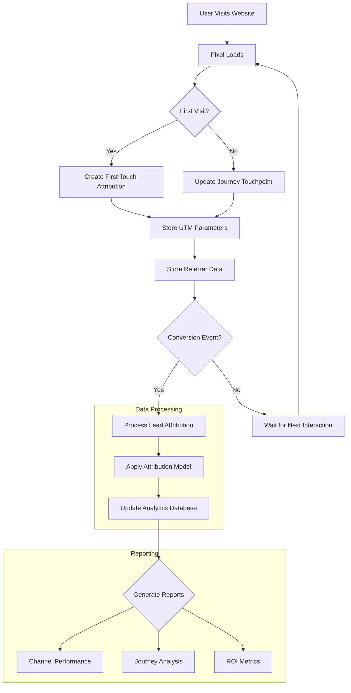
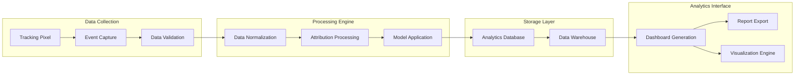
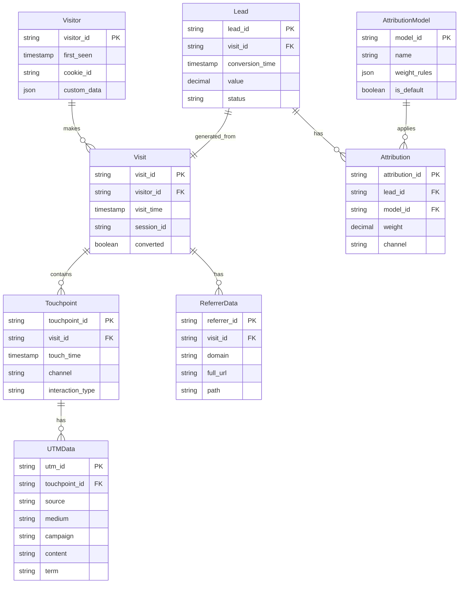
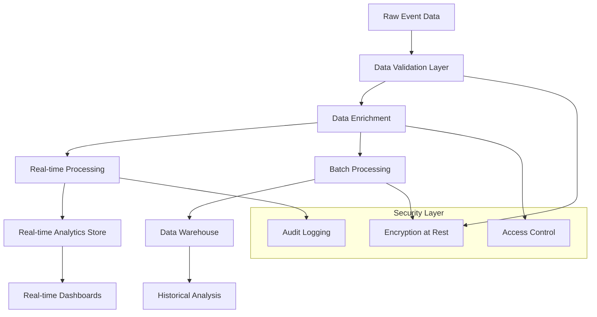

# Product Requirements Document (PRD)

# 1. INTRODUCTION

## 1.1 Purpose
This Product Requirements Document (PRD) outlines the comprehensive requirements for developing a multi-touch attribution analytics tool. The document serves as a reference for product managers, developers, QA engineers, and stakeholders involved in the development and implementation process. It provides detailed specifications, functional requirements, and technical constraints necessary for successful product delivery.

## 1.2 Scope
The multi-touch attribution analytics tool is designed to track and analyze customer journey touchpoints leading to lead conversion through pixel tracking implementation. The system will:

- Track and collect referrer data and UTM parameters across all user interactions
- Process and store attribution data for each lead generated
- Provide detailed attribution modeling across multiple customer touchpoints
- Generate actionable insights on marketing channel effectiveness
- Visualize the customer journey from first touch to conversion
- Calculate attribution weight distribution across different marketing channels
- Support real-time data collection and analysis
- Enable customizable attribution models and reporting

The tool will help marketing teams and business stakeholders:
- Optimize marketing spend across channels
- Understand the most effective customer journey paths
- Identify high-performing marketing touchpoints
- Make data-driven decisions for campaign optimization
- Measure true ROI of marketing initiatives

Out of scope for this version:
- Offline channel attribution
- Direct mail tracking
- Call center integration
- Custom API development for third-party tools
- Historical data import from external systems

# 2. PRODUCT DESCRIPTION

## 2.1 Product Perspective
The multi-touch attribution analytics tool operates as a standalone SaaS platform that integrates with existing website infrastructure through pixel implementation. The system consists of:

- Frontend tracking component (JavaScript pixel)
- Backend data collection and processing engine
- Analytics and reporting interface
- Data storage and management system
- API endpoints for data access

The tool interfaces with:
- Client websites (via tracking pixel)
- Marketing platforms (through UTM parameter tracking)
- Web browsers (for user session data)
- Database systems (for data storage and retrieval)

## 2.2 Product Functions
- User Journey Tracking
  - Capture first-touch attribution
  - Record intermediate touchpoints
  - Log conversion events
  - Store referrer data
  - Collect UTM parameters

- Data Processing
  - Clean and normalize tracking data
  - Apply attribution models
  - Calculate channel weights
  - Generate journey paths
  - Aggregate performance metrics

- Analytics and Reporting
  - Interactive dashboards
  - Custom report generation
  - Channel performance analysis
  - Journey visualization
  - ROI calculations
  - Export capabilities

## 2.3 User Characteristics

| User Type | Characteristics | Technical Expertise | Primary Goals |
|-----------|----------------|---------------------|---------------|
| Marketing Managers | Strategic decision makers | Intermediate | Campaign optimization, ROI analysis |
| Digital Marketers | Day-to-day campaign managers | Advanced | Channel performance, attribution insights |
| Business Analysts | Data interpreters | Advanced | Data analysis, report generation |
| Executives | Strategic oversight | Basic | High-level insights, ROI metrics |
| Technical Implementers | Development team | Expert | Pixel implementation, maintenance |

## 2.4 Constraints
- Technical Constraints
  - Browser cookie limitations
  - Cross-domain tracking restrictions
  - Data retention regulations
  - Real-time processing capabilities
  - Browser compatibility requirements

- Business Constraints
  - GDPR and CCPA compliance requirements
  - Data privacy regulations
  - Storage capacity limitations
  - Processing speed requirements
  - Scalability considerations

## 2.5 Assumptions and Dependencies
Assumptions:
- Users have basic understanding of marketing attribution concepts
- Websites have proper pixel implementation capabilities
- Consistent UTM parameter usage across marketing channels
- Stable internet connectivity for real-time tracking
- Modern browser support for JavaScript execution

Dependencies:
- Client website stability
- UTM parameter standardization
- Browser cookie acceptance
- Database system availability
- Network infrastructure reliability
- Third-party marketing platform integrations
- Data privacy compliance frameworks

# 3. PROCESS FLOWCHART

# 4. FUNCTIONAL REQUIREMENTS

## 4.1 Pixel Tracking Implementation

### ID: F001
### Description
JavaScript-based tracking pixel that captures user interactions, referrer data, and UTM parameters across the customer journey
### Priority
High

| Requirement ID | Requirement Description | Acceptance Criteria |
|---------------|------------------------|-------------------|
| F001.1 | Automatic pixel loading on page load | - Pixel loads asynchronously - Minimal impact on page performance - Compatible with major browsers |
| F001.2 | First-party cookie management | - Create unique visitor IDs - Store attribution data - Handle cookie consent |
| F001.3 | UTM parameter capture | - Track source, medium, campaign, content, term - Handle missing parameters - Validate parameter format |
| F001.4 | Referrer data collection | - Capture referring domain - Store full referrer URL - Handle direct traffic |

## 4.2 Data Processing Engine

### ID: F002
### Description
Backend system for processing and analyzing attribution data in real-time
### Priority
High

| Requirement ID | Requirement Description | Acceptance Criteria |
|---------------|------------------------|-------------------|
| F002.1 | Real-time data processing | - Process data within 5 seconds - Handle concurrent requests - Scale with traffic volume |
| F002.2 | Attribution model calculation | - Support first-touch attribution - Support last-touch attribution - Support linear attribution - Support custom model weights |
| F002.3 | Data normalization | - Standardize UTM parameters - Clean referrer data - Format timestamps |
| F002.4 | Journey path analysis | - Create sequential touchpoint paths - Calculate path frequencies - Identify conversion patterns |

## 4.3 Analytics Dashboard

### ID: F003
### Description
Interactive interface for viewing and analyzing attribution data
### Priority
Medium

| Requirement ID | Requirement Description | Acceptance Criteria |
|---------------|------------------------|-------------------|
| F003.1 | Channel performance metrics | - Display conversion rates - Show revenue attribution - Calculate ROI by channel |
| F003.2 | Journey visualization | - Visual path analysis - Interactive touchpoint mapping - Conversion funnel display |
| F003.3 | Custom reporting | - Flexible date ranges - Multiple attribution models - Export capabilities |
| F003.4 | Real-time monitoring | - Live data updates - Performance alerts - System status indicators |

## 4.4 Data Management

### ID: F004
### Description
System for storing and managing attribution data securely
### Priority
High

| Requirement ID | Requirement Description | Acceptance Criteria |
|---------------|------------------------|-------------------|
| F004.1 | Data storage | - Secure database implementation - Efficient query performance - Data backup systems |
| F004.2 | Data retention | - Configurable retention periods - Automated data cleanup - Archive functionality |
| F004.3 | Privacy compliance | - GDPR compliance - CCPA compliance - Data anonymization |
| F004.4 | Access control | - Role-based permissions - Audit logging - Security monitoring |

## 4.5 Integration Capabilities

### ID: F005
### Description
APIs and connectors for external system integration
### Priority
Medium

| Requirement ID | Requirement Description | Acceptance Criteria |
|---------------|------------------------|-------------------|
| F005.1 | API endpoints | - RESTful API implementation - Authentication system - Rate limiting |
| F005.2 | Data export | - CSV export - JSON export - Scheduled exports |
| F005.3 | Marketing platform integration | - Google Analytics connection - Facebook Ads integration - Custom webhook support |
| F005.4 | CRM integration | - Lead data synchronization - Revenue data import - Contact matching |

# 5. NON-FUNCTIONAL REQUIREMENTS

## 5.1 Performance Requirements

| Requirement | Specification | Success Criteria |
|------------|---------------|------------------|
| Response Time | - Dashboard loading < 3 seconds - Data processing < 5 seconds - API response < 1 second | 95th percentile of requests meet criteria |
| Throughput | - Handle 10,000 concurrent users - Process 1M events per minute - Support 100 simultaneous report generations | No degradation in performance |
| Resource Usage | - CPU utilization < 70% - Memory usage < 80% - Storage optimization with compression | Monitored via system metrics |
| Latency | - Pixel loading < 100ms - Real-time updates < 2 seconds - Database queries < 500ms | Measured across all regions |

## 5.2 Safety Requirements

| Requirement | Specification | Implementation |
|------------|---------------|----------------|
| Data Backup | - Hourly incremental backups - Daily full backups - 30-day retention period | Automated backup systems |
| Failure Recovery | - Automatic failover capability - Data recovery point < 1 hour - Recovery time < 4 hours | Disaster recovery plan |
| Error Handling | - Graceful degradation - Automated error logging - Error notification system | Monitoring and alerts |
| Data Integrity | - Checksum verification - Transaction consistency - Data validation checks | Database constraints |

## 5.3 Security Requirements

| Requirement | Specification | Implementation |
|------------|---------------|----------------|
| Authentication | - Multi-factor authentication - SSO integration - Password policy enforcement | Industry standard protocols |
| Authorization | - Role-based access control - Granular permissions - Access audit logs | Permission matrix |
| Data Encryption | - TLS 1.3 for transit - AES-256 for storage - Key rotation policy | Encryption standards |
| Privacy | - Data anonymization - PII protection - Consent management | Privacy frameworks |

## 5.4 Quality Requirements

| Category | Requirement | Target Metric |
|----------|-------------|---------------|
| Availability | - 99.9% uptime - 24/7 operation - Planned maintenance windows | Measured monthly |
| Maintainability | - Modular architecture - Documentation standards - Version control | Development practices |
| Usability | - Intuitive interface - Mobile responsiveness - Accessibility compliance | User satisfaction > 85% |
| Scalability | - Horizontal scaling - Auto-scaling capability - Load balancing | Performance under load |
| Reliability | - Mean time between failures > 720 hours - Error rate < 0.1% - Data accuracy > 99.9% | Monitored metrics |

## 5.5 Compliance Requirements

| Category | Requirement | Implementation |
|----------|-------------|----------------|
| Legal | - GDPR compliance - CCPA compliance - PIPEDA compliance | Privacy frameworks |
| Industry Standards | - ISO 27001 - SOC 2 Type II - CSA STAR | Certification process |
| Data Governance | - Data retention policies - Data classification - Audit trails | Governance framework |
| Reporting | - Compliance reporting - Regular audits - Incident reporting | Documentation system |

# 6. DATA REQUIREMENTS

## 6.1 Data Models

## 6.2 Data Storage

### 6.2.1 Primary Storage
- Distributed PostgreSQL cluster for transactional data
- ClickHouse for analytical data processing
- Redis for real-time data caching and session management

### 6.2.2 Data Retention
- Raw event data: 90 days
- Processed attribution data: 3 years
- Aggregated analytics: 5 years
- System logs: 1 year

### 6.2.3 Backup and Recovery
- Continuous incremental backups
- Daily full backups with point-in-time recovery
- Cross-region backup replication
- Maximum 4-hour recovery time objective (RTO)
- 15-minute recovery point objective (RPO)

### 6.2.4 Data Redundancy
- N+2 redundancy for critical data
- Active-active database configuration
- Geographic data replication across three regions
- Automatic failover mechanisms

## 6.3 Data Processing

### 6.3.1 Data Security
- AES-256 encryption at rest
- TLS 1.3 encryption in transit
- Field-level encryption for PII
- Data masking for sensitive information
- Role-based access control (RBAC)
- Regular security audits

### 6.3.2 Data Processing Requirements
- Maximum latency: 5 seconds for real-time processing
- Batch processing window: 1 hour
- Data validation rules enforcement
- Automatic error detection and correction
- Data deduplication
- Schema validation
- Data type enforcement

### 6.3.3 Data Quality Standards
- Completeness: 99.9%
- Accuracy: 99.99%
- Consistency checks
- Automated data cleansing
- Regular data quality audits
- Data reconciliation processes

# 7. EXTERNAL INTERFACES

## 7.1 User Interfaces

### 7.1.1 Dashboard Interface
- Responsive web application supporting 1024x768 minimum resolution
- Material Design 3.0 components for consistent UI elements
- Dark/light theme support with customizable color schemes
- Keyboard navigation and WCAG 2.1 Level AA compliance
- Support for modern browsers (Chrome 90+, Firefox 88+, Safari 14+, Edge 90+)

### 7.1.2 Interface Components
| Component | Requirements |
|-----------|--------------|
| Navigation | - Collapsible sidebar menu - Breadcrumb navigation - Quick action toolbar |
| Data Visualization | - Interactive charts and graphs - Customizable dashboards - Drag-and-drop report builder |
| Forms | - Dynamic filtering controls - Date range selectors - Advanced search functionality |
| Alerts | - Toast notifications - Modal confirmations - Status indicators |

## 7.2 Hardware Interfaces

### 7.2.1 Server Requirements
- Minimum 8-core CPU servers for data processing
- 32GB RAM minimum per server instance
- SSD storage with minimum 1000 IOPS
- Network interface supporting 10Gbps throughput

### 7.2.2 Client Requirements
- Modern CPU supporting JavaScript execution
- Minimum 4GB RAM for dashboard operation
- Network connection supporting 1Mbps minimum bandwidth
- Display capable of 1024x768 resolution or higher

## 7.3 Software Interfaces

### 7.3.1 Integration Points

| System | Interface Type | Purpose |
|--------|---------------|----------|
| Web Browsers | JavaScript API | Pixel tracking implementation |
| PostgreSQL | Database Driver | Primary data storage |
| ClickHouse | Native TCP | Analytics data processing |
| Redis | Redis Protocol | Session and cache management |

### 7.3.2 Third-Party Integrations
- Google Analytics API (REST)
- Facebook Marketing API (GraphQL)
- CRM Systems (REST/SOAP)
- Marketing Automation Platforms (REST)

## 7.4 Communication Interfaces

### 7.4.1 Network Protocols
- HTTPS for all external communications
- WebSocket for real-time updates
- gRPC for internal service communication
- TCP/IP for database connections

### 7.4.2 Data Formats

| Interface | Format | Schema |
|-----------|--------|---------|
| REST API | JSON | OpenAPI 3.0 |
| Event Stream | Protocol Buffers | Version 3 |
| Export Files | CSV, JSON, XLSX | RFC 4180 |
| Backup Data | Binary | Custom Format |

### 7.4.3 API Specifications
- RESTful API endpoints with JWT authentication
- Rate limiting: 1000 requests per minute per client
- Maximum payload size: 5MB
- Response time SLA: 500ms (95th percentile)
- Batch processing support for up to 1000 records

# 8. APPENDICES

## 8.1 GLOSSARY

| Term | Definition |
|------|------------|
| Attribution Model | A rule, or set of rules, that determines how credit for sales and conversions is assigned to touchpoints in conversion paths |
| Conversion Path | The sequence of interactions that led to a desired outcome (e.g., lead generation) |
| First-Touch Attribution | Giving 100% credit to the first channel that brought a user to the website |
| Last-Touch Attribution | Giving 100% credit to the final channel that led to conversion |
| Linear Attribution | Distributing credit equally across all touchpoints in a conversion path |
| Multi-Touch Attribution | The process of determining the value of each marketing touchpoint leading to a conversion |
| Pixel | A snippet of JavaScript code that tracks user behavior on a website |
| Touchpoint | Any interaction between a potential customer and your brand |
| UTM Parameters | Tracking parameters added to URLs to track the source of website traffic |

## 8.2 ACRONYMS

| Acronym | Full Form |
|---------|-----------|
| API | Application Programming Interface |
| CCPA | California Consumer Privacy Act |
| CRM | Customer Relationship Management |
| CSV | Comma-Separated Values |
| GDPR | General Data Protection Regulation |
| IOPS | Input/Output Operations Per Second |
| JWT | JSON Web Token |
| PII | Personally Identifiable Information |
| PIPEDA | Personal Information Protection and Electronic Documents Act |
| REST | Representational State Transfer |
| ROI | Return on Investment |
| SLA | Service Level Agreement |
| SOAP | Simple Object Access Protocol |
| SSO | Single Sign-On |
| TLS | Transport Layer Security |
| UTM | Urchin Tracking Module |
| WCAG | Web Content Accessibility Guidelines |

## 8.3 ADDITIONAL REFERENCES

| Resource | Description | URL |
|----------|-------------|-----|
| Google Analytics Documentation | Reference for UTM parameter implementation | https://support.google.com/analytics/answer/1033867 |
| IAB Attribution Guidelines | Industry standards for attribution modeling | https://www.iab.com/guidelines/attribution-hub/ |
| MDN Web Docs | JavaScript implementation reference | https://developer.mozilla.org/en-US/docs/Web |
| OpenAPI Specification | REST API documentation standard | https://swagger.io/specification/ |
| Protocol Buffers | Data serialization format documentation | https://developers.google.com/protocol-buffers |
| Web Storage API | Browser storage implementation guide | https://developer.mozilla.org/en-US/docs/Web/API/Web_Storage_API |