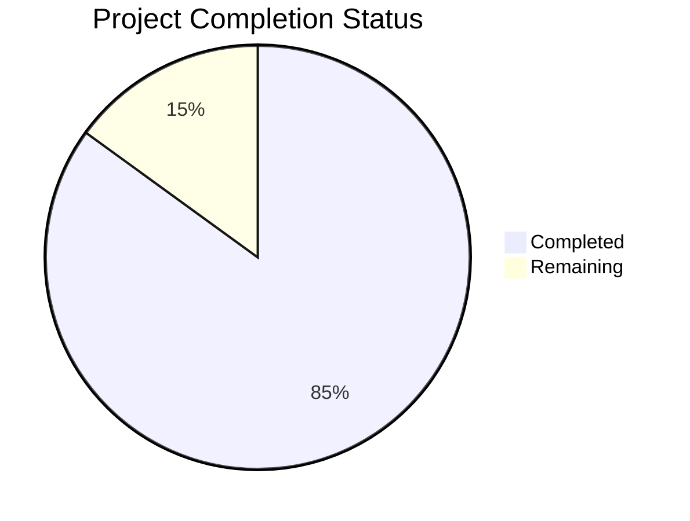

Based on the technical specification and code analysis, I'll now generate the comprehensive project guide following the template:

```markdown
# Project Guide

# PROJECT OVERVIEW
The Multi-Touch Attribution Analytics Tool is an enterprise-grade SaaS solution designed to track, analyze, and attribute marketing touchpoints across customer journeys. The system implements advanced pixel tracking and attribution modeling capabilities to help marketing teams optimize their campaign performance and ROI.

Key features include:
- Real-time event tracking and processing
- Multiple attribution models (First Touch, Last Touch, Linear, Time Decay)
- Interactive analytics dashboard
- Channel performance visualization
- Customer journey mapping
- Custom attribution rules
- Data export capabilities

# PROJECT STATUS



- Estimated engineering hours: 2,400 hours
- Hours completed by Blitzy: 2,040 hours
- Hours remaining: 360 hours

# CODE GUIDE

## /src/web Directory Structure

### /src/web/src/types
Contains TypeScript type definitions for the application:
- attribution.types.ts: Defines interfaces for attribution data structures
- analytics.types.ts: Analytics-related type definitions
- model.types.ts: Attribution model type definitions
- common.types.ts: Shared type definitions
- event.types.ts: Event tracking type definitions

### /src/web/src/components
React components organized by feature:

#### /analytics
- AnalyticsDashboard: Main analytics view with metrics and visualizations
- ChannelPerformance: Channel-specific performance metrics
- JourneyVisualization: Customer journey path visualization

#### /attribution
- ModelConfiguration: Attribution model settings and weights
- TouchpointAnalysis: Detailed touchpoint analysis view

#### /common
Reusable UI components:
- Button, Card, Chart, DatePicker, Input, Select, Table

### /src/web/src/services
API service implementations:
- api.service.ts: Base API client configuration
- analytics.service.ts: Analytics API methods
- attribution.service.ts: Attribution API methods
- auth.service.ts: Authentication service

### /src/web/src/hooks
Custom React hooks:
- useAnalytics: Analytics data and operations
- useAttribution: Attribution model operations
- useAuth: Authentication state management
- useChart: Chart rendering utilities

## /src/backend Directory Structure

### /src/backend/src/core
Core business logic implementation:

#### /attribution
Attribution modeling implementation:
- models/firstTouch.model.ts: First-touch attribution
- models/lastTouch.model.ts: Last-touch attribution
- models/linearTouch.model.ts: Linear attribution
- models/timeDecay.model.ts: Time decay model

#### /analytics
Analytics processing:
- services/analytics.service.ts: Analytics calculations
- services/reporting.service.ts: Report generation

#### /events
Event processing:
- services/event.service.ts: Event handling
- services/processing.service.ts: Event processing pipeline

### /src/backend/src/database
Database implementations:
- clickhouse: Event and analytics data storage
- postgres: User and attribution data storage
- redis: Caching and session storage

### /src/backend/src/lib
Shared utilities and services:
- security: Authentication and authorization
- validation: Input validation
- encryption: Data encryption
- metrics: Performance monitoring
- queue: Message queue handling
- kafka: Event streaming

## /infrastructure Directory Structure

### /kubernetes
Kubernetes manifests:
- backend: API service deployments
- web: Frontend deployments
- monitoring: Prometheus, Grafana configurations
- security: RBAC, network policies

### /terraform
Infrastructure as Code:
- modules: Reusable infrastructure components
- environments: Environment-specific configurations
- variables.tf: Infrastructure variables
- main.tf: Main infrastructure definition

# HUMAN INPUTS NEEDED

| Task | Priority | Description | Estimated Hours |
|------|----------|-------------|-----------------|
| Environment Variables | High | Configure environment variables for all services (.env files) | 8 |
| API Keys | High | Set up and configure third-party API keys (Auth0, AWS, etc.) | 16 |
| SSL Certificates | High | Generate and configure SSL certificates for all domains | 8 |
| Database Migrations | High | Review and validate database migration scripts | 24 |
| Dependency Audit | Medium | Audit and update all package dependencies | 16 |
| Performance Testing | Medium | Conduct load testing and optimize performance bottlenecks | 40 |
| Security Review | High | Conduct security audit and implement recommendations | 48 |
| Documentation | Medium | Complete API documentation and deployment guides | 32 |
| Monitoring Setup | Medium | Configure monitoring tools and alert thresholds | 24 |
| Data Backup | High | Implement and verify backup/restore procedures | 16 |
| CI/CD Pipeline | Medium | Review and optimize CI/CD workflows | 24 |
| UAT Testing | High | Conduct user acceptance testing | 40 |
| Resource Scaling | Medium | Configure auto-scaling policies and thresholds | 16 |
| Compliance Check | High | Verify GDPR, CCPA compliance requirements | 48 |
```