# Technical Specifications

# 1. INTRODUCTION

## 1.1 EXECUTIVE SUMMARY

The Multi-Touch Attribution Analytics Tool is a comprehensive SaaS solution designed to track, analyze, and attribute the value of marketing touchpoints across the customer journey. This system addresses the critical business challenge of understanding marketing effectiveness across multiple channels by implementing advanced pixel tracking and attribution modeling capabilities. The solution targets marketing teams, business analysts, and executives who need data-driven insights to optimize marketing spend and improve campaign performance. By providing accurate attribution data and actionable insights, the system enables organizations to increase marketing ROI and make informed decisions about channel investments.

The system will deliver measurable business impact through improved marketing efficiency, reduced customer acquisition costs, and optimized channel performance, with an expected 20-30% improvement in marketing spend effectiveness.

## 1.2 SYSTEM OVERVIEW

### Project Context

| Aspect | Details |
|--------|----------|
| Market Position | Enterprise-grade attribution solution for mid to large-scale marketing operations |
| Current Limitations | Existing solutions lack real-time processing, multi-touch modeling, and granular journey analysis |
| Enterprise Integration | Seamless integration with existing marketing platforms, CRM systems, and analytics tools |

### High-Level Description

The system architecture comprises:
- JavaScript-based tracking pixel for data collection
- Real-time data processing engine
- Advanced attribution modeling system
- Interactive analytics dashboard
- Secure data storage and management infrastructure
- RESTful API layer for integrations

### Success Criteria

| Category | Metrics |
|----------|---------|
| Technical Performance | - 99.9% system uptime<br>- < 5s data processing latency<br>- Support for 10M+ events/day |
| Business Metrics | - 25% improvement in campaign ROI<br>- 90% user adoption rate<br>- 15% reduction in CAC |
| Data Quality | - 99.9% data accuracy<br>- 100% regulatory compliance<br>- < 0.1% data loss rate |

## 1.3 SCOPE

### In-Scope Elements

| Category | Components |
|----------|------------|
| Core Features | - First/last touch attribution<br>- Multi-touch attribution modeling<br>- Custom attribution rules<br>- Journey visualization<br>- Real-time reporting |
| Implementation | - Web-based tracking<br>- Digital channel integration<br>- Marketing platform connectors<br>- Data export capabilities |
| User Groups | - Marketing teams<br>- Business analysts<br>- Executive stakeholders<br>- Technical administrators |
| Data Coverage | - UTM parameters<br>- Referrer data<br>- User interactions<br>- Conversion events |

### Out-of-Scope Elements

| Category | Exclusions |
|----------|------------|
| Features | - Offline channel tracking<br>- Direct mail attribution<br>- Call center integration<br>- Custom API development |
| Technical | - Legacy system migration<br>- Historical data import<br>- Third-party pixel integration<br>- Custom reporting engines |
| Implementation | - On-premise deployment<br>- White-label solutions<br>- Mobile app tracking<br>- IoT device integration |
| Geography | - Non-web channels<br>- Offline markets<br>- Restricted territories |

# 2. SYSTEM ARCHITECTURE

## 2.1 High-Level Architecture

```mermaid
C4Context
    title System Context Diagram - Multi-Touch Attribution Analytics Tool

    Person(user, "Marketing User", "Uses analytics dashboard")
    Person(admin, "System Admin", "Manages system")
    
    System_Boundary(attribution, "Attribution Analytics System") {
        System(web, "Web Application", "Provides analytics interface")
        System(tracking, "Tracking System", "Collects user journey data")
        System(processing, "Processing Engine", "Analyzes attribution data")
        System(storage, "Data Storage", "Stores attribution data")
    }

    System_Ext(website, "Client Website", "Hosts tracking pixel")
    System_Ext(crm, "CRM Systems", "Lead data")
    System_Ext(marketing, "Marketing Platforms", "Campaign data")

    Rel(user, web, "Views analytics")
    Rel(admin, attribution, "Manages")
    Rel(website, tracking, "Sends events")
    Rel(attribution, crm, "Syncs lead data")
    Rel(attribution, marketing, "Fetches campaign data")
```

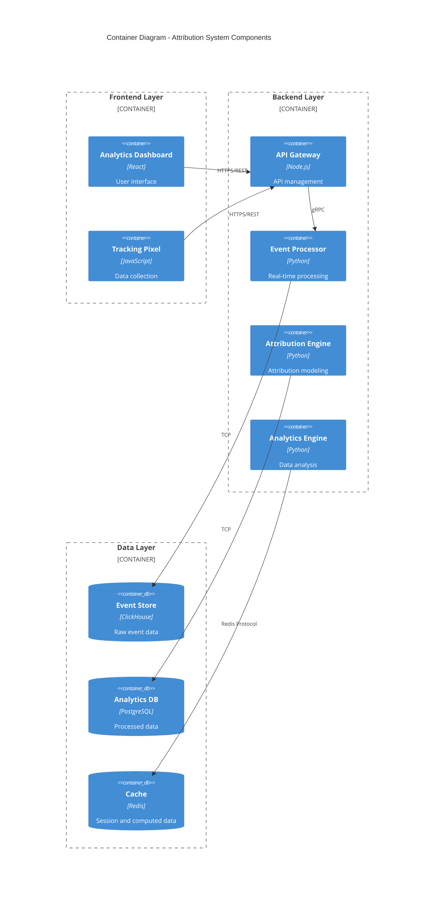

## 2.2 Component Details

### 2.2.1 Frontend Components

| Component | Technologies | Purpose | Scaling Strategy |
|-----------|-------------|---------|------------------|
| Tracking Pixel | JavaScript ES6+ | User journey tracking | Client-side caching |
| Analytics Dashboard | React, Redux, Material-UI | Data visualization | CDN distribution |
| Report Generator | TypeScript | Custom report creation | Worker threads |

### 2.2.2 Backend Components

| Component | Technologies | Purpose | Scaling Strategy |
|-----------|-------------|---------|------------------|
| API Gateway | Node.js, Express | Request routing | Horizontal scaling |
| Event Processor | Python, FastAPI | Real-time processing | Queue-based processing |
| Attribution Engine | Python, NumPy | Attribution modeling | Distributed computing |
| Analytics Engine | Python, Pandas | Data analysis | Worker pools |

### 2.2.3 Data Storage Components

| Component | Technology | Purpose | Scaling Strategy |
|-----------|------------|---------|------------------|
| Event Store | ClickHouse | Raw event storage | Sharding |
| Analytics DB | PostgreSQL | Processed data | Read replicas |
| Cache Layer | Redis | Performance optimization | Cluster mode |

## 2.3 Technical Decisions

### 2.3.1 Architecture Patterns

| Pattern | Implementation | Justification |
|---------|---------------|---------------|
| Microservices | Domain-based services | Scalability and maintainability |
| Event-Driven | Apache Kafka | Real-time processing requirements |
| CQRS | Separate read/write paths | Performance optimization |
| Circuit Breaker | Resilience4j | Fault tolerance |

### 2.3.2 Data Flow Architecture

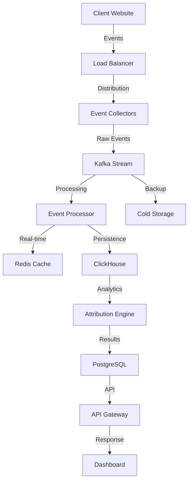

## 2.4 Cross-Cutting Concerns

### 2.4.1 System Monitoring

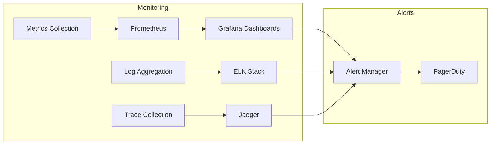

### 2.4.2 Security Architecture

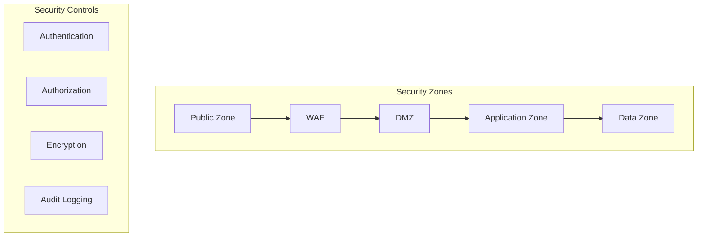

## 2.5 Deployment Architecture

```mermaid
C4Deployment
    title Deployment Diagram - Production Environment

    Deployment_Node(cdn, "CDN", "CloudFront") {
        Container(static, "Static Assets")
    }

    Deployment_Node(aws, "AWS Region") {
        Deployment_Node(eks, "Kubernetes Cluster") {
            Container(api_pods, "API Pods")
            Container(processor_pods, "Processor Pods")
            Container(analytics_pods, "Analytics Pods")
        }
        
        Deployment_Node(data, "Data Layer") {
            ContainerDb(clickhouse, "ClickHouse Cluster")
            ContainerDb(postgres, "PostgreSQL Cluster")
            ContainerDb(redis, "Redis Cluster")
        }
    }

    Rel(cdn, eks, "HTTPS")
    Rel(eks, data, "Secure Connection")
```

# 3. SYSTEM COMPONENTS ARCHITECTURE

## 3.1 USER INTERFACE DESIGN

### 3.1.1 Design Specifications

| Category | Requirements | Implementation Details |
|----------|--------------|----------------------|
| Visual Hierarchy | Material Design 3.0 principles | - Z-axis layering<br>- Typography scale<br>- Spacing system (8px grid) |
| Component Library | Custom design system | - Atomic design methodology<br>- Reusable component library<br>- Shared style tokens |
| Responsive Design | Mobile-first approach | - Breakpoints: 320px, 768px, 1024px, 1440px<br>- Fluid typography<br>- Flexible grid system |
| Accessibility | WCAG 2.1 Level AA | - ARIA labels<br>- Keyboard navigation<br>- Screen reader support |
| Browser Support | Modern browsers | - Chrome 90+<br>- Firefox 88+<br>- Safari 14+<br>- Edge 90+ |
| Theming | Dark/Light modes | - Theme switching<br>- Custom color palettes<br>- Automatic system preference detection |
| i18n/l10n | Multi-language support | - RTL support<br>- Date/number formatting<br>- Translation management |

### 3.1.2 Interface Elements

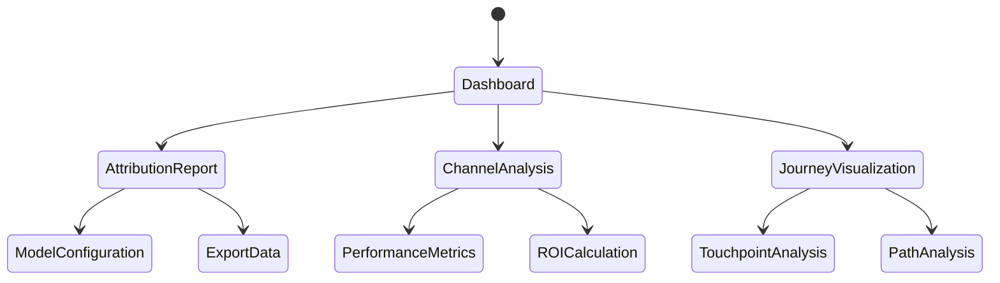

### 3.1.3 Critical User Flows

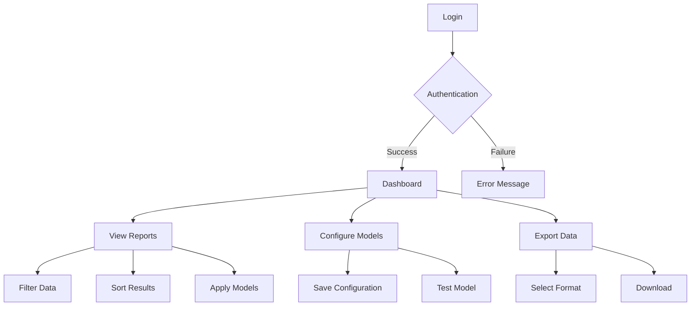

## 3.2 DATABASE DESIGN

### 3.2.1 Schema Design

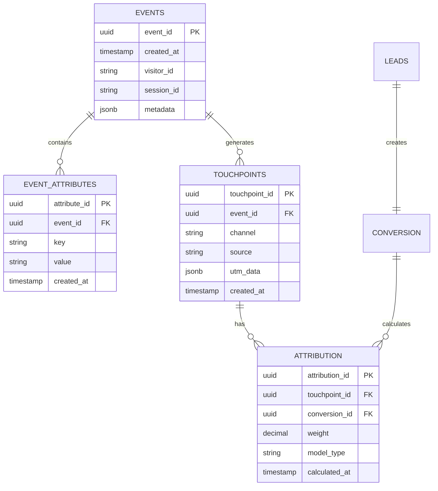

### 3.2.2 Data Management Strategy

| Aspect | Strategy | Implementation |
|--------|----------|----------------|
| Partitioning | Time-based partitioning | - Monthly partitions for events<br>- Quarterly partitions for analytics |
| Indexing | Multi-level indexing | - B-tree indexes for lookups<br>- BRIN indexes for time-series data |
| Archival | Tiered storage | - Hot data: 90 days in primary storage<br>- Warm data: 1 year in secondary storage<br>- Cold data: 5+ years in archive |
| Backup | Multi-region strategy | - Continuous incremental backups<br>- Daily full backups<br>- Cross-region replication |
| Security | Encryption and access control | - Column-level encryption<br>- Row-level security<br>- Audit logging |

## 3.3 API DESIGN

### 3.3.1 API Architecture

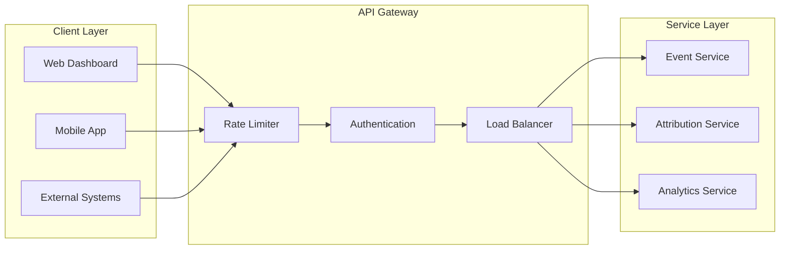

### 3.3.2 API Specifications

| Endpoint Category | Authentication | Rate Limit | Cache Strategy |
|------------------|----------------|------------|----------------|
| Event Collection | API Key | 10000/min | No Cache |
| Attribution Data | JWT | 1000/min | 5min TTL |
| Analytics | JWT | 100/min | 15min TTL |
| Configuration | JWT | 50/min | 1hr TTL |

### 3.3.3 Integration Patterns

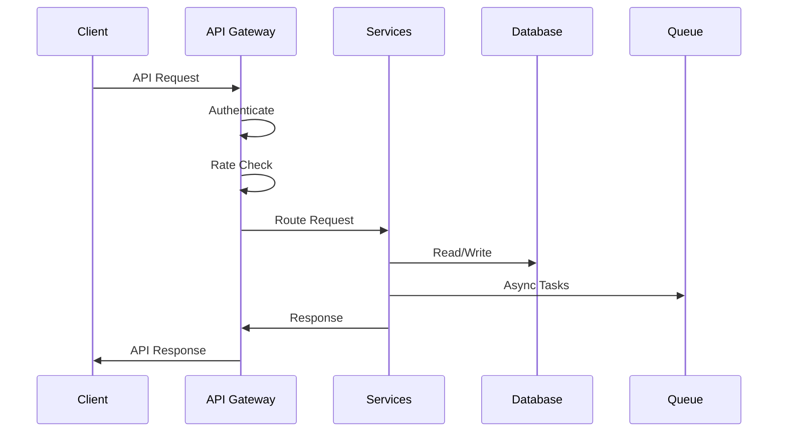

# 4. TECHNOLOGY STACK

## 4.1 PROGRAMMING LANGUAGES

| Platform/Component | Language | Version | Justification |
|-------------------|----------|---------|---------------|
| Frontend Tracking | JavaScript | ES6+ | - Browser compatibility<br>- Async/await support<br>- Module system |
| Frontend Dashboard | TypeScript | 4.9+ | - Type safety<br>- Enhanced IDE support<br>- React integration |
| Backend Services | Python | 3.11+ | - Data processing capabilities<br>- ML library ecosystem<br>- Async support |
| API Gateway | Node.js | 18 LTS | - High throughput<br>- Event-driven architecture<br>- NPM ecosystem |
| Data Processing | Python | 3.11+ | - NumPy/Pandas integration<br>- Statistical libraries<br>- Performance optimizations |

## 4.2 FRAMEWORKS & LIBRARIES

### 4.2.1 Frontend Stack

| Component | Framework/Library | Version | Purpose |
|-----------|------------------|---------|---------|
| UI Framework | React | 18.2+ | - Component-based architecture<br>- Virtual DOM performance<br>- Large ecosystem |
| State Management | Redux Toolkit | 1.9+ | - Predictable state updates<br>- DevTools integration<br>- Middleware support |
| UI Components | Material-UI | 5.0+ | - Design system compliance<br>- Accessibility support<br>- Theming capabilities |
| Data Visualization | D3.js | 7.0+ | - Custom visualizations<br>- Animation support<br>- SVG manipulation |
| API Client | Axios | 1.4+ | - Request interceptors<br>- Response transformation<br>- Error handling |

### 4.2.2 Backend Stack

| Component | Framework/Library | Version | Purpose |
|-----------|------------------|---------|---------|
| API Framework | FastAPI | 0.100+ | - AsyncIO support<br>- OpenAPI integration<br>- High performance |
| Processing Engine | NumPy/Pandas | 2.0+/2.0+ | - Data manipulation<br>- Statistical operations<br>- Performance optimization |
| Task Queue | Celery | 5.3+ | - Async task processing<br>- Distributed operations<br>- Scheduling support |
| ORM | SQLAlchemy | 2.0+ | - Database abstraction<br>- Migration support<br>- Query optimization |
| Testing | pytest | 7.0+ | - Async testing<br>- Fixture support<br>- Coverage reporting |

## 4.3 DATABASES & STORAGE

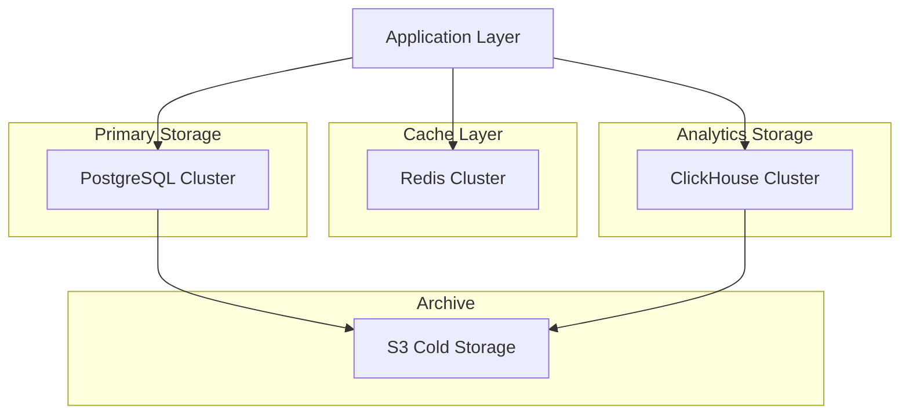

| Type | Technology | Version | Purpose |
|------|------------|---------|---------|
| Primary Database | PostgreSQL | 15+ | - Transactional data<br>- ACID compliance<br>- JSON support |
| Analytics Database | ClickHouse | 23.3+ | - Column-oriented storage<br>- High-speed analytics<br>- Real-time aggregation |
| Cache Layer | Redis | 7.0+ | - Session storage<br>- Result caching<br>- Rate limiting |
| Object Storage | AWS S3 | N/A | - Raw event storage<br>- Backup storage<br>- Static assets |

## 4.4 THIRD-PARTY SERVICES

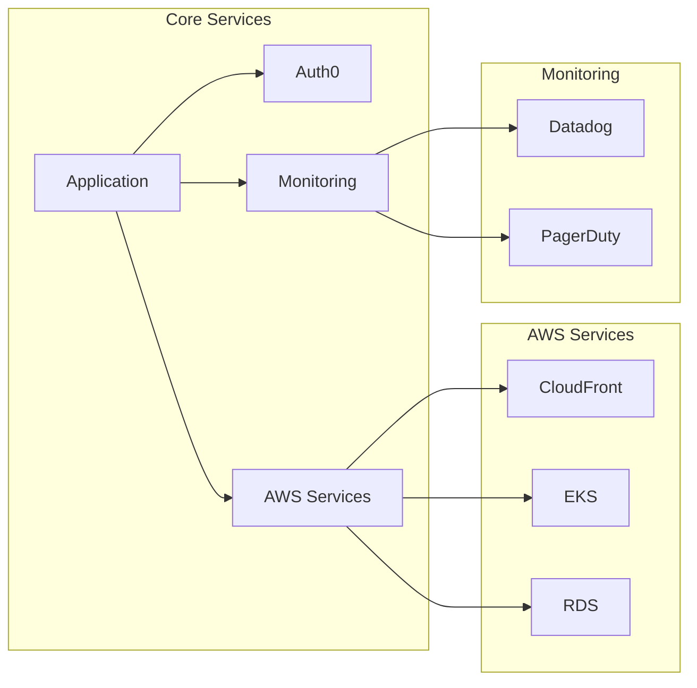

| Category | Service | Purpose | Integration Method |
|----------|---------|---------|-------------------|
| Authentication | Auth0 | - User authentication<br>- SSO support<br>- Role management | OAuth 2.0/OIDC |
| CDN | CloudFront | - Static asset delivery<br>- Edge caching<br>- DDoS protection | Direct integration |
| Monitoring | Datadog | - Application metrics<br>- Log aggregation<br>- APM | Agent-based |
| Error Tracking | Sentry | - Error reporting<br>- Performance monitoring<br>- Issue tracking | SDK integration |

## 4.5 DEVELOPMENT & DEPLOYMENT

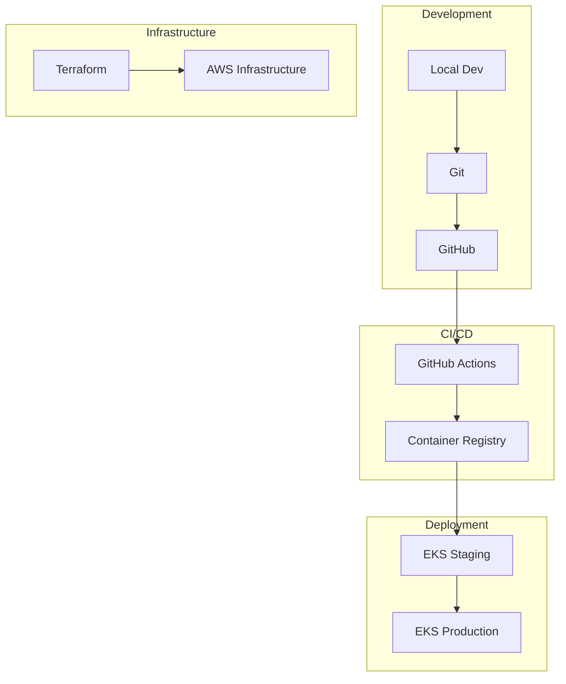

| Category | Tool | Version | Purpose |
|----------|------|---------|---------|
| Version Control | Git | 2.40+ | - Source control<br>- Branch management<br>- Code review |
| Container Runtime | Docker | 24.0+ | - Application containerization<br>- Local development<br>- CI/CD pipeline |
| Orchestration | Kubernetes | 1.26+ | - Container orchestration<br>- Service scaling<br>- Resource management |
| IaC | Terraform | 1.5+ | - Infrastructure provisioning<br>- Environment parity<br>- Configuration management |
| CI/CD | GitHub Actions | N/A | - Automated testing<br>- Container builds<br>- Deployment automation |

# 5. SYSTEM DESIGN

## 5.1 USER INTERFACE DESIGN

### 5.1.1 Dashboard Layout

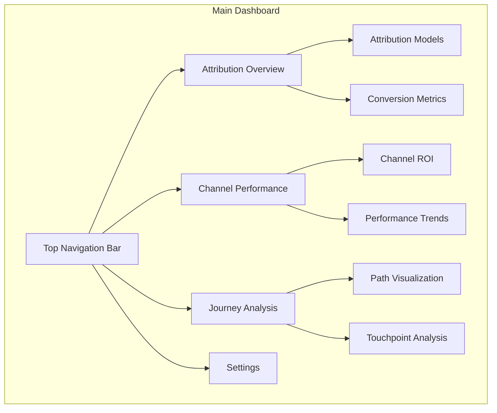

### 5.1.2 Key Interface Components

| Component | Description | Functionality |
|-----------|-------------|---------------|
| Attribution Overview | Main dashboard view | - Model comparison<br>- Key metrics display<br>- Time period selection |
| Channel Performance | Channel analysis interface | - ROI by channel<br>- Trend visualization<br>- Filter controls |
| Journey Analysis | Customer path visualization | - Interactive path diagram<br>- Touchpoint details<br>- Conversion funnel |
| Model Configuration | Attribution model settings | - Model selection<br>- Weight adjustment<br>- Rule configuration |

### 5.1.3 Interactive Elements

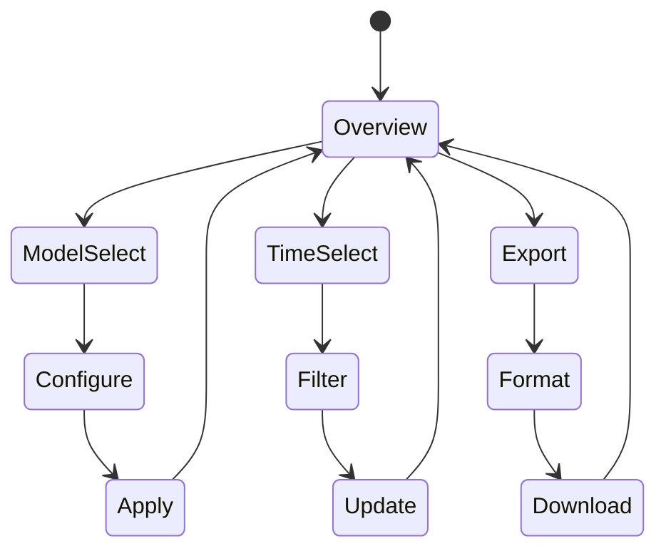

## 5.2 DATABASE DESIGN

### 5.2.1 Schema Structure

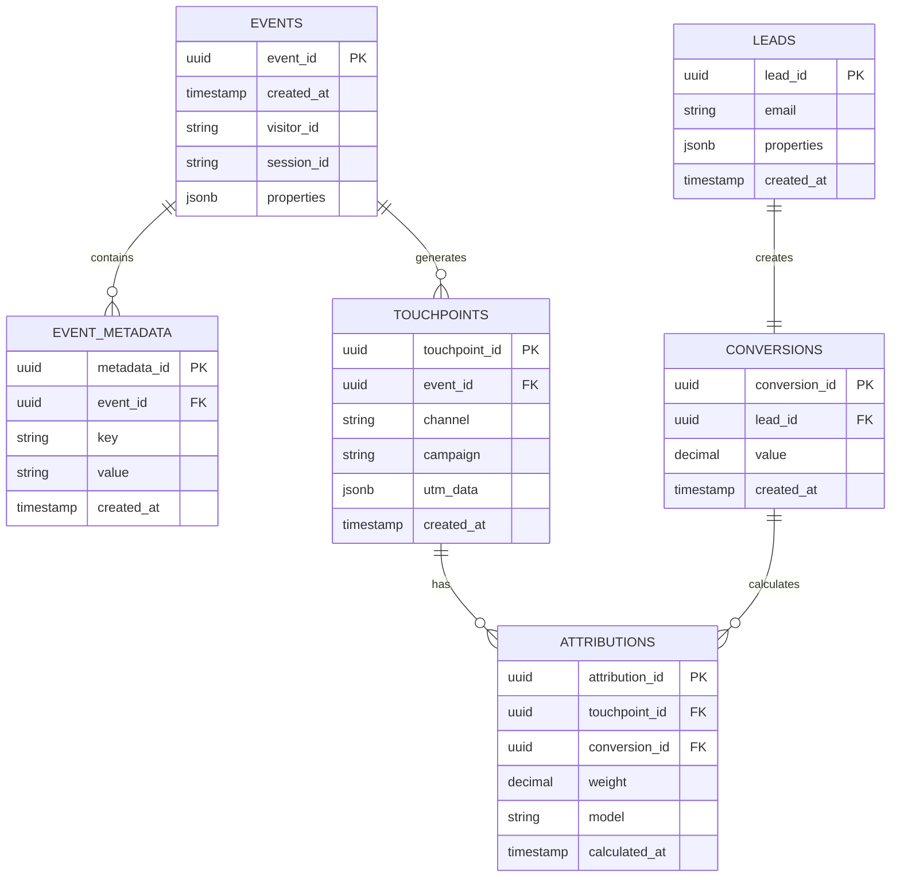

### 5.2.2 Data Storage Strategy

| Data Type | Storage Solution | Retention Policy |
|-----------|-----------------|------------------|
| Event Data | ClickHouse | 90 days active, 1 year archived |
| Attribution Results | PostgreSQL | 1 year active, 5 years archived |
| Session Data | Redis | 24 hours |
| Analytics Data | ClickHouse | 1 year active, 3 years archived |

## 5.3 API DESIGN

### 5.3.1 API Architecture

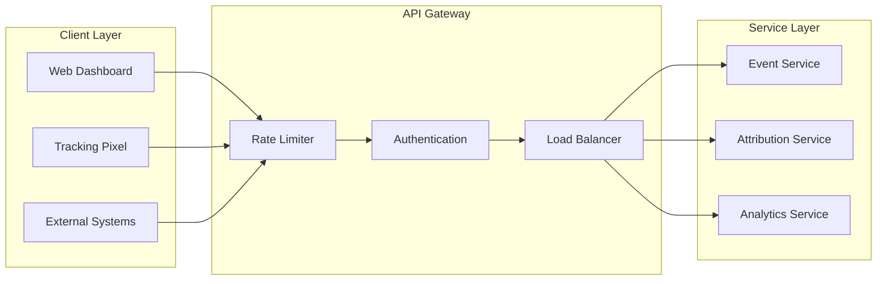

### 5.3.2 API Endpoints

| Endpoint | Method | Purpose | Rate Limit |
|----------|--------|---------|------------|
| /api/v1/events | POST | Track user events | 10000/min |
| /api/v1/attribution | GET | Retrieve attribution data | 1000/min |
| /api/v1/analytics | GET | Fetch analytics results | 100/min |
| /api/v1/models | PUT | Update attribution models | 50/min |

### 5.3.3 Data Flow

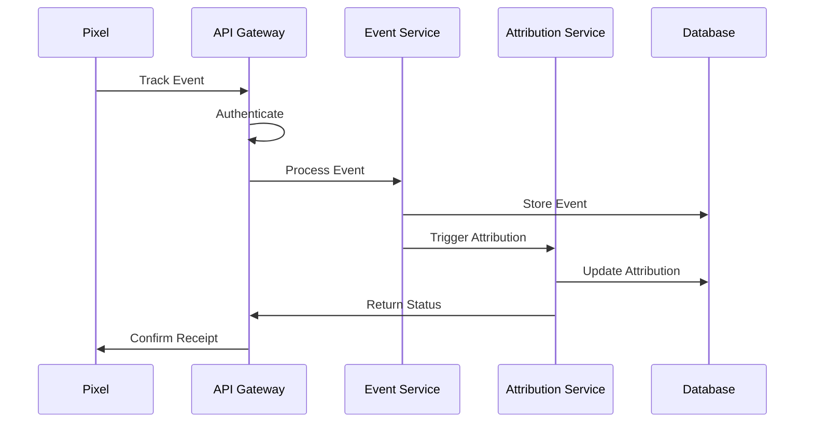

### 5.3.4 Integration Patterns

| Pattern | Implementation | Use Case |
|---------|---------------|-----------|
| Event Sourcing | Kafka Streams | Real-time event processing |
| CQRS | Separate read/write paths | Performance optimization |
| Pub/Sub | Redis Pub/Sub | Real-time updates |
| Webhook | HTTP POST | External system notifications |

# 6. USER INTERFACE DESIGN

## 6.1 Interface Components Key

```
Icons:
[?] - Help/Information tooltip
[$] - Financial/Revenue data
[i] - Informational element
[+] - Add new/Create
[x] - Close/Delete/Remove
[<] [>] - Navigation/Pagination
[^] - Upload/Export
[#] - Dashboard/Menu
[@] - User profile/Account
[!] - Alert/Warning
[=] - Settings/Configuration
[*] - Favorite/Important

Interactive Elements:
[ ] - Checkbox
( ) - Radio button
[Button] - Clickable button
[...] - Text input field
[====] - Progress/Loading bar
[v] - Dropdown menu
```

## 6.2 Main Dashboard

```
+----------------------------------------------------------+
|  [@] Admin User     [?] Help    [=] Settings    [x] Exit  |
+----------------------------------------------------------+
|  [#] Attribution Dashboard                     [$] Revenue |
+----------------------------------------------------------+
|                                                           |
|  Channel Performance         Attribution Model            |
|  +------------------------+  +------------------------+    |
|  |  [v] Time Period      |  |  [v] Model Type       |    |
|  |                       |  |  ( ) First Touch      |    |
|  |  [====] Social 45%    |  |  ( ) Last Touch      |    |
|  |  [===] Email 35%      |  |  (*) Multi-Touch     |    |
|  |  [==] PPC 20%         |  |                      |    |
|  +------------------------+  +------------------------+    |
|                                                          |
|  Journey Visualization                                   |
|  +--------------------------------------------------+   |
|  |                                                   |   |
|  |    [Social] --> [Email] --> [PPC] --> [Convert]  |   |
|  |    [*]          [*]         [ ]        [!]       |   |
|  |                                                   |   |
|  +--------------------------------------------------+   |
|                                                          |
|  [< Prev]  Page 1 of 5  [Next >]     [^ Export Data]    |
+----------------------------------------------------------+
```

## 6.3 Attribution Configuration

```
+----------------------------------------------------------+
|  [#] Attribution Settings                    [@] Admin     |
+----------------------------------------------------------+
|                                                           |
|  Model Configuration                                      |
|  +--------------------------------------------------+    |
|  |  Model Name: [..............................]     |    |
|  |                                                   |    |
|  |  Channel Weights:                                 |    |
|  |  Social Media  [...] %                           |    |
|  |  Email        [...] %                            |    |
|  |  PPC          [...] %                            |    |
|  |  Direct       [...] %                            |    |
|  |                                                   |    |
|  |  [!] Total must equal 100%                       |    |
|  +--------------------------------------------------+    |
|                                                           |
|  Rules Configuration                                      |
|  +--------------------------------------------------+    |
|  |  [ ] Apply first touch bonus                      |    |
|  |  [ ] Include time decay                           |    |
|  |  [ ] Custom channel grouping                      |    |
|  |                                                   |    |
|  |  Time Window: [v] 30 Days                         |    |
|  +--------------------------------------------------+    |
|                                                           |
|  [Save Changes]  [Reset Default]  [Cancel]                |
+----------------------------------------------------------+
```

## 6.4 Journey Analysis View

```
+----------------------------------------------------------+
|  [#] Customer Journey Analysis              [@] Admin      |
+----------------------------------------------------------+
|  Filters: [...................] [Apply] [Reset]           |
+----------------------------------------------------------+
|                                                           |
|  Path Analysis                                            |
|  +--------------------------------------------------+    |
|  |  Entry Points                 Exit Points         |    |
|  |  +-- Social (45%)            +-- Purchase (60%)  |    |
|  |  +-- Direct (30%)            +-- Abandon (40%)   |    |
|  |  +-- PPC (25%)                                   |    |
|  |                                                   |    |
|  |  Common Paths:                                    |    |
|  |  1. Social -> Email -> Purchase  [*] 35%         |    |
|  |  2. PPC -> Purchase             [ ] 25%          |    |
|  |  3. Direct -> Abandon           [ ] 20%          |    |
|  +--------------------------------------------------+    |
|                                                           |
|  Touchpoint Details                                       |
|  +--------------------------------------------------+    |
|  |  Selected: Social Media                           |    |
|  |  Conversion Rate: [===] 35%                       |    |
|  |  Average Value: [$] 125.00                       |    |
|  |  Time to Convert: 48 hours                        |    |
|  +--------------------------------------------------+    |
|                                                           |
|  [^ Export Report]  [Save View]  [Share Analysis]         |
+----------------------------------------------------------+
```

## 6.5 Responsive Design Breakpoints

| Screen Size | Layout Adjustments |
|-------------|-------------------|
| Desktop (1200px+) | Full 3-column layout |
| Tablet (768px-1199px) | 2-column layout, stacked charts |
| Mobile (320px-767px) | Single column, collapsible sections |

## 6.6 Interaction States

| Element | Default | Hover | Active | Disabled |
|---------|---------|-------|---------|-----------|
| Buttons | [Button] | [Button]* | [BUTTON] | [-Button-] |
| Links | _link_ | _link_* | *link* | ~link~ |
| Inputs | [...] | [.*.] | [***] | [---] |
| Dropdowns | [v] | [V] | [^] | [-] |

## 6.7 Color Scheme

| Element | Light Theme | Dark Theme |
|---------|------------|------------|
| Background | White | #1E1E1E |
| Text | #333333 | #FFFFFF |
| Primary Actions | #0066CC | #3399FF |
| Secondary Actions | #666666 | #999999 |
| Alerts | #FF3333 | #FF6666 |
| Success | #33CC33 | #66FF66 |

## 6.8 Typography

| Element | Font | Size | Weight |
|---------|------|------|--------|
| Headers | Inter | 24px | 600 |
| Body Text | Inter | 16px | 400 |
| Labels | Inter | 14px | 500 |
| Buttons | Inter | 16px | 600 |
| Data | Roboto Mono | 14px | 400 |

# 7. SECURITY CONSIDERATIONS

## 7.1 AUTHENTICATION AND AUTHORIZATION

### 7.1.1 Authentication Methods

| Method | Implementation | Use Case |
|--------|---------------|-----------|
| JWT Tokens | Auth0 integration | API access and session management |
| OAuth 2.0 | OpenID Connect | SSO and third-party integrations |
| MFA | Time-based OTP | High-privilege account access |
| API Keys | SHA-256 hashed | Tracking pixel implementation |

### 7.1.2 Authorization Matrix

| Role | Dashboard Access | Data Access | Admin Functions | API Access |
|------|-----------------|-------------|-----------------|------------|
| Admin | Full | Full | Full | Full |
| Analyst | Full | Read-only | None | Read-only |
| Marketing User | Limited | Filtered | None | None |
| API Client | None | Endpoint-specific | None | Scoped |

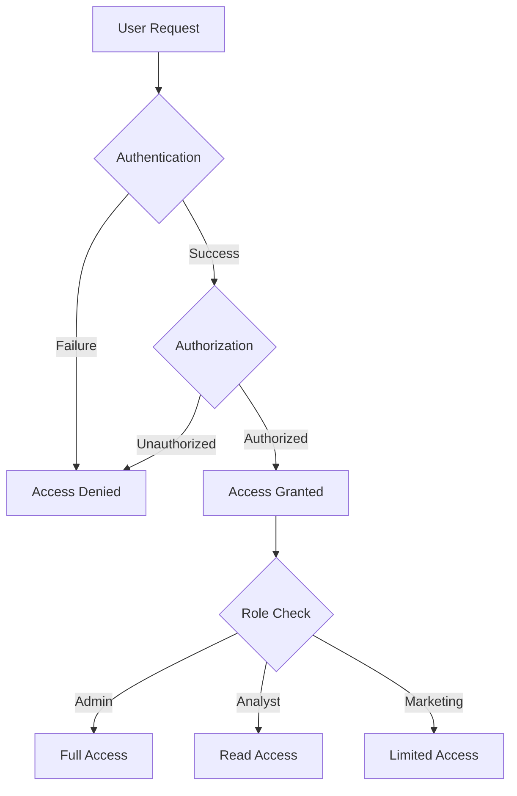

## 7.2 DATA SECURITY

### 7.2.1 Encryption Standards

| Data State | Method | Key Management |
|------------|--------|----------------|
| In Transit | TLS 1.3 | Automatic rotation |
| At Rest | AES-256-GCM | AWS KMS |
| PII Fields | Field-level encryption | Separate key hierarchy |
| Backups | AES-256-CBC | Offline key storage |

### 7.2.2 Data Classification

| Level | Description | Security Controls |
|-------|-------------|------------------|
| Critical | PII, Authentication credentials | Field-level encryption, Access logging |
| Sensitive | Attribution data, Lead information | Row-level security, Audit trails |
| Internal | Analytics, Aggregated data | Role-based access, Standard encryption |
| Public | Marketing metrics, Documentation | No special controls |

```mermaid
flowchart LR
    subgraph Data Classification
    A[Data Input] --> B{Classification Check}
    B -->|Critical| C[Maximum Security]
    B -->|Sensitive| D[Enhanced Security]
    B -->|Internal| E[Standard Security]
    B -->|Public| F[Basic Security]
    end
    
    subgraph Security Controls
    C --> G[Field Encryption]
    D --> H[Row Security]
    E --> I[Basic Encryption]
    F --> J[Public Access]
    end
```

## 7.3 SECURITY PROTOCOLS

### 7.3.1 Access Control

| Control Type | Implementation | Monitoring |
|-------------|----------------|------------|
| Network | AWS Security Groups | CloudWatch |
| Application | Role-based ACL | Auth0 Logs |
| Database | Row-level security | PostgreSQL Audit |
| API | OAuth 2.0 scopes | API Gateway Logs |

### 7.3.2 Security Monitoring

```mermaid
flowchart TD
    subgraph Detection
    A[Security Events] --> B[Log Collection]
    B --> C[Analysis Engine]
    C --> D{Threat Detection}
    end
    
    subgraph Response
    D -->|Alert| E[Security Team]
    D -->|Block| F[Access Control]
    D -->|Log| G[Audit Trail]
    end
    
    subgraph Prevention
    H[Security Rules] --> I[WAF]
    I --> J[Rate Limiting]
    J --> K[Input Validation]
    end
```

### 7.3.3 Compliance Controls

| Requirement | Implementation | Validation |
|-------------|----------------|------------|
| GDPR | Data minimization, Consent management | Annual audit |
| CCPA | Data inventory, Access controls | Quarterly review |
| SOC 2 | Security monitoring, Access logging | Continuous monitoring |
| ISO 27001 | Security policies, Risk assessment | Semi-annual audit |

### 7.3.4 Security Testing

| Test Type | Frequency | Tools |
|-----------|-----------|-------|
| Penetration Testing | Quarterly | Burp Suite, OWASP ZAP |
| Vulnerability Scanning | Weekly | Nessus, AWS Inspector |
| Code Security Analysis | Per commit | SonarQube, Snyk |
| Dependency Audit | Daily | npm audit, OWASP Dependency Check |

### 7.3.5 Incident Response

```mermaid
flowchart LR
    A[Detection] -->|Alert| B[Classification]
    B -->|Critical| C[Immediate Response]
    B -->|High| D[Priority Response]
    B -->|Medium| E[Standard Response]
    B -->|Low| F[Scheduled Response]
    
    C --> G[Incident Management]
    D --> G
    E --> G
    F --> G
    
    G --> H[Resolution]
    H --> I[Post-Mortem]
    I --> J[Update Security]
```

# 8. INFRASTRUCTURE

## 8.1 DEPLOYMENT ENVIRONMENT

```mermaid
flowchart TD
    subgraph Production Environment
        A[AWS Cloud] --> B[Multi-Region Deployment]
        B --> C[Primary Region]
        B --> D[Secondary Region]
        B --> E[DR Region]
        
        C --> F[Availability Zones]
        F --> G[AZ-1]
        F --> H[AZ-2]
        F --> I[AZ-3]
    end
```

| Environment | Purpose | Configuration |
|-------------|---------|---------------|
| Development | Feature development and testing | Single region, minimal resources |
| Staging | Pre-production testing and validation | Multi-AZ, production-like setup |
| Production | Live system operation | Multi-region, high availability |
| DR | Disaster recovery and failover | Standby configuration |

## 8.2 CLOUD SERVICES

| Service Category | AWS Service | Purpose | Configuration |
|-----------------|-------------|---------|---------------|
| Compute | EKS | Container orchestration | Production: 3 node groups, min 6 nodes |
| Database | Aurora PostgreSQL | Transactional data | Multi-AZ, auto-scaling |
| Analytics | ClickHouse on EC2 | Analytics processing | Distributed cluster, 6 nodes |
| Caching | ElastiCache | Session and data caching | Redis cluster mode |
| Storage | S3 | Object storage | Standard + Glacier lifecycle |
| CDN | CloudFront | Static asset delivery | Global edge locations |
| Security | WAF, Shield | DDoS protection | Enterprise protection |
| Monitoring | CloudWatch | System monitoring | Enhanced metrics enabled |

## 8.3 CONTAINERIZATION

```mermaid
flowchart LR
    subgraph Container Architecture
        A[Base Images] --> B[Service Images]
        B --> C[Application Containers]
        
        subgraph Base Images
            D[Node.js]
            E[Python]
            F[Nginx]
        end
        
        subgraph Service Images
            G[API Service]
            H[Processing Service]
            I[Analytics Service]
        end
    end
```

| Component | Base Image | Size Limit | Configuration |
|-----------|------------|------------|---------------|
| API Service | node:18-alpine | 250MB | Multi-stage build |
| Event Processor | python:3.11-slim | 500MB | Optimized dependencies |
| Analytics Engine | python:3.11-slim | 750MB | ML libraries included |
| Nginx Proxy | nginx:alpine | 100MB | Custom configuration |

## 8.4 ORCHESTRATION

```mermaid
flowchart TD
    subgraph Kubernetes Architecture
        A[Ingress Controller] --> B[Service Mesh]
        B --> C[Application Services]
        
        subgraph Application Services
            D[API Pods]
            E[Processor Pods]
            F[Analytics Pods]
        end
        
        subgraph Infrastructure Services
            G[Monitoring]
            H[Logging]
            I[Security]
        end
    end
```

| Component | Configuration | Scaling Policy |
|-----------|--------------|----------------|
| Node Groups | 3 groups (app, processing, analytics) | Auto-scaling (2-12 nodes) |
| Pod Resources | CPU: 0.5-4 cores, Memory: 1-8GB | HPA based on CPU/Memory |
| Service Mesh | Istio | mTLS, traffic management |
| Storage | EBS CSI Driver | Dynamic provisioning |

## 8.5 CI/CD PIPELINE

```mermaid
flowchart LR
    A[Source Code] --> B[Build Stage]
    B --> C[Test Stage]
    C --> D[Security Scan]
    D --> E[Artifact Creation]
    E --> F[Deployment Stage]
    
    subgraph Environments
        F --> G[Development]
        F --> H[Staging]
        F --> I[Production]
    end
```

| Stage | Tools | Configuration | SLA |
|-------|-------|---------------|-----|
| Source Control | GitHub | Branch protection, required reviews | N/A |
| Build | GitHub Actions | Multi-stage Dockerfile builds | < 10 mins |
| Test | Jest, Pytest | Unit, integration, e2e tests | < 20 mins |
| Security | Snyk, SonarQube | SAST, dependency scanning | < 15 mins |
| Artifact | ECR | Image scanning, versioning | < 5 mins |
| Deployment | ArgoCD | GitOps, automated rollback | < 30 mins |

### 8.5.1 Deployment Process

```mermaid
flowchart TD
    A[Code Merge] --> B{Build Success?}
    B -->|Yes| C[Run Tests]
    B -->|No| D[Notify Team]
    C --> E{Tests Pass?}
    E -->|Yes| F[Security Scan]
    E -->|No| D
    F --> G{Scan Clear?}
    G -->|Yes| H[Push Artifacts]
    G -->|No| D
    H --> I[Deploy to Dev]
    I --> J{Dev Healthy?}
    J -->|Yes| K[Deploy to Staging]
    J -->|No| L[Rollback]
    K --> M{Staging Healthy?}
    M -->|Yes| N[Deploy to Prod]
    M -->|No| L
```

# 8. APPENDICES

## 8.1 ADDITIONAL TECHNICAL INFORMATION

### 8.1.1 Attribution Model Calculations

```mermaid
flowchart TD
    A[Raw Touchpoint Data] --> B{Attribution Model}
    B -->|First Touch| C[100% First Channel]
    B -->|Last Touch| D[100% Last Channel]
    B -->|Linear| E[Equal Distribution]
    B -->|Time Decay| F[Time-based Weights]
    B -->|Position Based| G[Custom Position Weights]
    
    C --> H[Attribution Results]
    D --> H
    E --> H
    F --> H
    G --> H
    
    H --> I[Store Results]
    I --> J[Update Analytics]
```

### 8.1.2 Data Retention Schedule

| Data Type | Active Storage | Archive | Deletion |
|-----------|---------------|---------|-----------|
| Event Data | 90 days | 1 year | After archive |
| Attribution Results | 1 year | 5 years | After archive |
| User Sessions | 30 days | None | Immediate |
| System Logs | 30 days | 1 year | After archive |
| Analytics Reports | 1 year | 3 years | After archive |

### 8.1.3 Error Handling States

```mermaid
stateDiagram-v2
    [*] --> Normal
    Normal --> Warning: Performance Degradation
    Normal --> Error: System Failure
    Warning --> Normal: Auto-Recovery
    Warning --> Error: Escalation
    Error --> Normal: Manual Intervention
    Error --> [*]: System Shutdown
```

## 8.2 GLOSSARY

| Term | Definition |
|------|------------|
| Attribution Window | The time period during which touchpoints are considered for attribution |
| Conversion Rate | Percentage of visitors who complete a desired action |
| Customer Journey | Complete sequence of interactions leading to conversion |
| Data Warehouse | Centralized repository for all structured data |
| Event Stream | Real-time flow of user interaction data |
| Pixel Tracking | Method of collecting user behavior data via JavaScript |
| Position-Based Model | Attribution model giving different weights based on touchpoint position |
| Time Decay | Attribution model giving more weight to recent touchpoints |
| Touchpoint Weight | Percentage of conversion credit assigned to a specific interaction |

## 8.3 ACRONYMS

| Acronym | Full Form |
|---------|-----------|
| APM | Application Performance Monitoring |
| CAC | Customer Acquisition Cost |
| CDN | Content Delivery Network |
| CQRS | Command Query Responsibility Segregation |
| CSA | Cloud Security Alliance |
| ETL | Extract, Transform, Load |
| HPA | Horizontal Pod Autoscaling |
| IaC | Infrastructure as Code |
| KMS | Key Management Service |
| MFA | Multi-Factor Authentication |
| MTBF | Mean Time Between Failures |
| OLAP | Online Analytical Processing |
| PII | Personally Identifiable Information |
| RBAC | Role-Based Access Control |
| RPO | Recovery Point Objective |
| RTO | Recovery Time Objective |
| SaaS | Software as a Service |
| SAST | Static Application Security Testing |
| SLA | Service Level Agreement |
| WAF | Web Application Firewall |